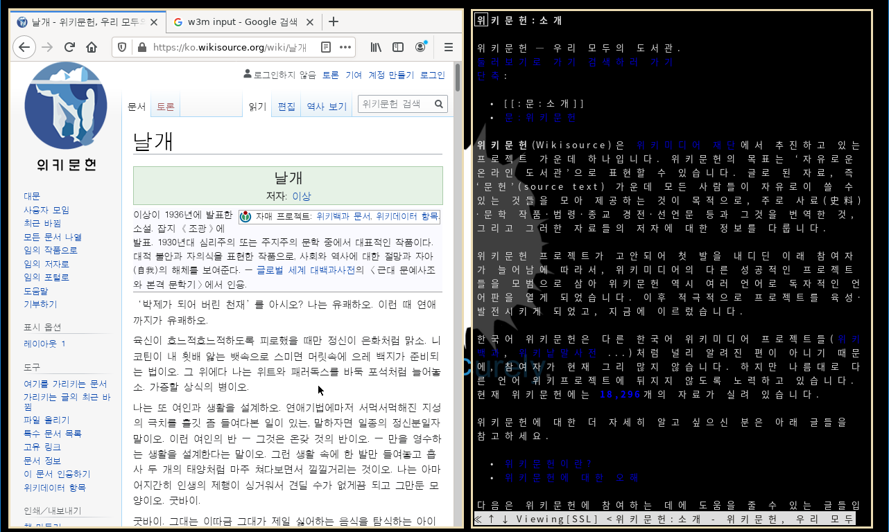

# OBSD-Environment

is stand for OpenBSD Environment (for me)
Yeah, Let me state that, I'm totally beginner for this operating system and windows manager. I always wanted to use this awesome operating system, but postponed because I'm so lazy.

## Current status

* WM : CWM
* Terminal : URXvt (rxvt-unicode)
* Font : Noto Sans CJK KR
* Wallpaper : https://wallpaperplay.com/walls/full/e/b/6/266523.jpg#.XyUSESlD5s8.link

* Terminal is transparent!

## To-Do

* Make SCIM does its work

## Screenshots

vim, cmatrix and ufetch via urxvt

firefox, w3m via urxvt
